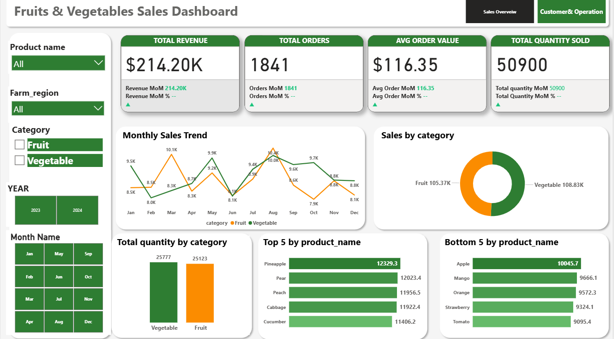
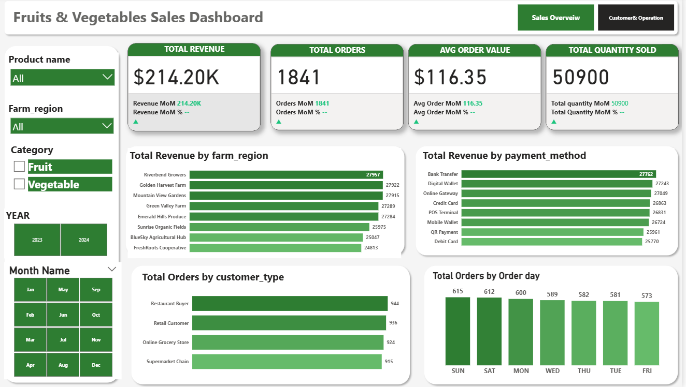

# sql_powerbi_fruits_vegetables_sales_dashboard
## Project Overview
This project presents an end-to-end data analysis workflow using SQL (PostgreSQL) and Power BI. The goal was to analyze sales performance, customer behavior, and product trends to support business decision-making.

## Data Source
The dataset includes sales transactions covering revenue, orders, product categories, regions, and customer types.

## Tools & Technologies
- SQL (PostgreSQL - pgAdmin 4)
- Power BI
- Excel

## Data Cleaning & Preparation (SQL)
- Created structured tables in PostgreSQL
- Cleaned and transformed raw data
- Performed aggregations and filtering using SQL queries

## Key Analysis Performed
- Total revenue, orders, and quantity sold
- Sales by region and payment method
- Customer segmentation analysis
- Monthly sales trend analysis
- Top 5 and bottom 5 products

## Key Insights
- Vegetable category generated slightly higher revenue than fruits
- Certain regions consistently outperform others
- Discounts and pricing influence order volume
- Sales peak during specific months

## Dashboard Preview

### Sales Overview

### Customer & Operations

## Conclusion
This project demonstrates the integration of SQL and Power BI to extract insights and build interactive dashboards for business analysis.
